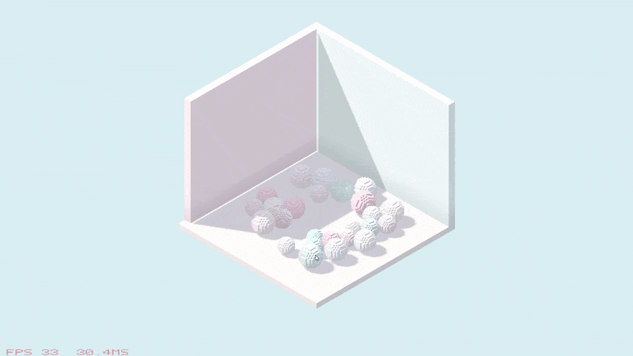
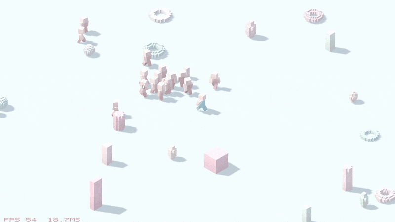
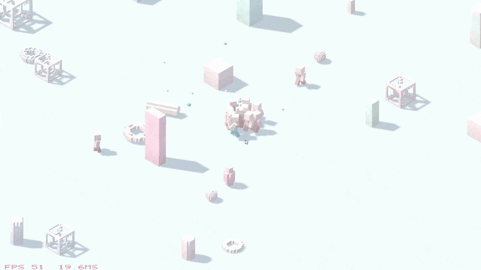
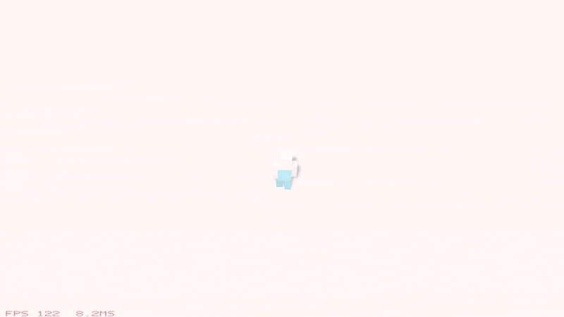

# Patch

Raymarched voxel engine with deterministic simulation and destruction

- **Simulation:** C11, data-oriented, chunked voxel volumes
- **Orchestration/render/platform:** C++20 (Vulkan renderer + Win32 window/input)
- **No third-party dependencies:** all engine code is self-contained

## Sample scenes

*Can be found in `.github/legacy/`, kept for demonstration purposes since the engine itself doesn't have a dedicated content pipeline.*

- **Ball Pit**



- **Combat**




- **Building**



## Project structure

```
patch/
├── engine/        # Reusable engine code (no game logic)
│   ├── core/      # Types, math, RNG, arenas
│   ├── voxel/     # Chunked volumes (32³), occupancy, connectivity
│   ├── physics/   # Physics, particles, broadphase
│   ├── sim/       # Scene tick, entities, voxel objects, terrain detach
│   ├── render/    # Vulkan renderer (read-only view of sim state)
│   └── platform/  # Win32 window/input/time
├── content/       # C data descriptors (materials, scenes, voxel shapes)
├── game/          # Sample scenes + render-view builders
├── tools/         # Build-time utilities
├── tests/         # Automated tests running in during compile time
├── shaders/       # GLSL shaders (compiled + embedded at build time)
└── app/           # Thin executable wiring everything together
```

## Tools

### voxelize

Build-time OBJ mesh to C voxel shape converter. Generates `VoxelShape` descriptors for `content/`.

```shell
./build/voxelize.exe input.obj output.c [--name <name>] [--resolution <n>] [--material <id>]
```

- Uses triangle-AABB overlap (Separating Axis Theorem) for conservative voxelization
- Self-contained OBJ parser
- Output is a C source file ready for inclusion in `content/voxel_shapes.c`

## Build

### Requirements

- Windows
- Vulkan SDK (`Vulkan::glslc` for shader compilation)
- CMake 3.21+
- C/C++ toolchain (MSVC recommended)

### Configure + build

```shell
cmake -B build -G Ninja
cmake --build build
```

Shaders are compiled from `shaders/` and embedded as SPIR-V (no runtime file I/O).

### No Vulkan SDK build

If you don't have the Vulkan SDK installed, use prebuilt shaders:

```shell
cmake -B build -G Ninja -DPATCH_USE_PREBUILT_SHADERS=ON
cmake --build build
```

### Run

```shell
./build/patch_samples.exe
```

## Tests

C-only tests integrated with CTest:

```shell
ctest --test-dir build --output-on-failure
```
