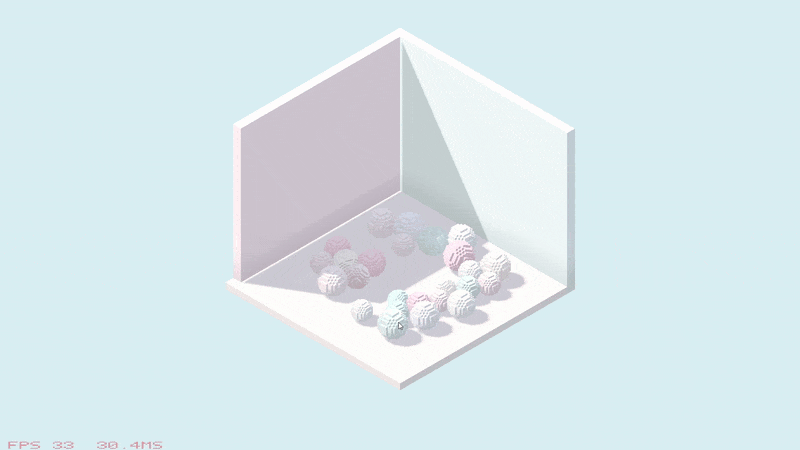
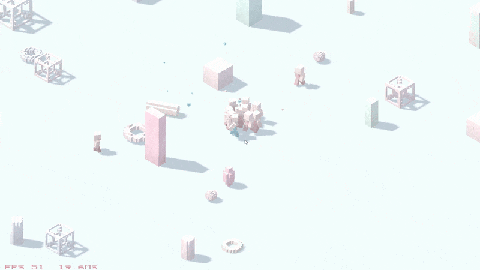
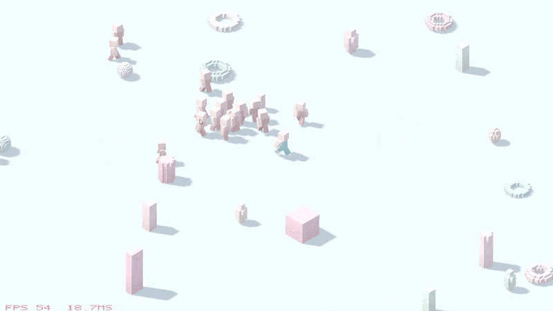

# Patch

HDDA raymarched voxel engine with real-time destruction, procedural world generation, and physics simulation.

## Sample Scenes (legacy scenes, under .github/legacy)






## Features

- **HDDA Raymarching** - Hierarchical DDA traversal with 2-level occupancy acceleration (chunk + region bitmasks)
- **Deferred Rendering Pipeline** - G-buffer, temporal shadows, temporal AO, TAA, spatial denoising
- **Procedural World Generation** - Biome-driven terrain with 9 biome types, 18 procedural tree species, flora scatter system
- **Noise Library** - Value noise, FBM, Billow, and RidgedMulti noise for terrain variety
- **34 Materials** - Terrain (stone, dirt, grass, sand, snow, ice), tree bark/leaf variants, flora, decoratives, metal
- **Real-Time Destruction** - Voxel damage with connectivity analysis, island detachment, debris particles
- **Physics Simulation** - Rigid body dynamics with voxel-based collision, gravity, friction
- **Environmental Particles** - 8 particle types (leaf, dust, firefly, snow, pollen, drip, steam, bee) with wind
- **Voxel Objects** - Independent physics-driven voxel entities with BVH acceleration

## Architecture

```text
engine/core/       Math, RNG, noise, profiling, spatial hashing
engine/voxel/      Volume storage, occupancy mips, connectivity
engine/sim/        Scene management, env particles, loading
engine/physics/    Rigid body, collision, particles
engine/render/     Vulkan renderer, shaders, UI
engine/platform/   Window, input, timing
content/           Materials, shapes, scene descriptors
game/              Terrain gen, tree gen, scatter gen, biome system
shaders/           GLSL compute + fragment shaders
app/               Application entry point
```

Simulation and content are C23. Rendering and platform are C++23. The renderer is a read-only view of simulation state.

## Quick Start

### Requirements

- Windows 10/11
- CMake 3.21+
- MSVC (Visual Studio 2022) or compatible C23/C++23 compiler
- Ninja build system
- Vulkan 1.3+ capable GPU
- Vulkan SDK (optional - prebuilt shaders included)

### Build & Run

```shell
cmake -B build -G Ninja
cmake --build build
./build/patch_samples.exe
```

### Without Vulkan SDK (uses prebuilt shaders)

```shell
cmake -B build -G Ninja -DPATCH_USE_PREBUILT_SHADERS=ON
cmake --build build
```

### Run Tests

```shell
ctest --test-dir build --output-on-failure
```

## World Generation

The procedural world uses a biome system driven by temperature and humidity noise:

| Biome     | Surface    | Trees                          |
| --------- | ---------- | ------------------------------ |
| Grassland | Grass/Dirt | Oak, Maple, Cherry, Birch      |
| Forest    | Grass/Dirt | Oak, Birch, Chestnut, Redwood  |
| Desert    | Sand       | None                           |
| Snow      | Snow/Dirt  | Frostpine, Pine                |
| Jungle    | Grass/Dirt | Jungle, Palm                   |
| Swamp     | Dirt       | Swamp, Mangrove                |
| Savannah  | Grass/Dirt | Acacia, Baobab                 |
| Taiga     | Snow/Dirt  | Pine, Cedar, Frostpine         |
| Mountain  | Stone      | Cedar, Pine                    |

Tree species are selected via weighted proclivity curves (bell-curve fitness per temperature/humidity), creating smooth biome transitions instead of hard boundaries.

Terrain uses 6-octave FBM for base landscape with RidgedMulti noise for mountain ridges, slope-based cliff detection, and biome-driven surface materials.

## Tools

**voxelize** - Convert OBJ to voxel:

```shell
./build/voxelize.exe model.obj output.c --resolution 16
```
